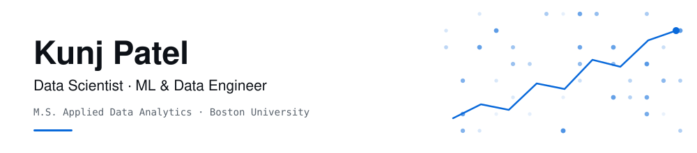

<picture>
  <source media="(prefers-color-scheme: dark)" srcset="assets/header-dark.svg">
  
</picture>

I build data systems end to end, from a 25 GB Spark pipeline to the model and the dashboard someone actually opens. Before grad school I spent a year shipping production software: a hospital information system used by 1,000+ healthcare workers, and a sales-analytics platform where I went from intern to leading a team of five.

What I care about: **picking the metric that matters, not the one that's easy.** My favourite result so far is showing that the *second-least* accurate of six heart-disease models is the one that saves the most lives.

- 🎓 &nbsp;M.S. Applied Data Analytics, **Boston University** (GPA 3.8)
- 🔭 &nbsp;Looking for **Data Science / ML / Data Engineering** internships and new-grad roles
- 📫 &nbsp;[LinkedIn](https://linkedin.com/in/kunj2710) · [kunjpatel271002@gmail.com](mailto:kunjpatel271002@gmail.com) · Boston, MA

 

## Selected work

**[WikiFlow](https://github.com/Kunj2710/wikiflow)**: Predicting Wikipedia editor dropout from 60M revision events
 Logistic regression and K-Means written from scratch on Spark RDDs, a distributed Keras DNN, and live scoring of the Wikipedia edit stream through Kafka. Runs on GCP Dataproc and BigQuery. &nbsp;`PySpark` `Kafka` `GCP` `Keras`

**[Beyond Accuracy](https://github.com/Kunj2710/cvd-referral-cost-classifier)**: Choosing a heart-disease model by what mistakes actually cost
 Six classifiers on 70K patients. Once they're ranked by clinical cost, a model that placed 5th on accuracy saves **$9.7M and 65 missed diagnoses per 10K patients**. Includes fairness, robustness and sensitivity audits. &nbsp;`scikit-learn` `pandas`

**[RAG Document Q&A](https://github.com/Kunj2710/rag-document-qa)**: Ask questions across PDFs, web pages, Wikipedia and arXiv
 LangChain pipeline with pluggable vector stores (Chroma, FAISS, ObjectBox) and LLMs (OpenAI, Groq, local), served through a Streamlit UI and a FastAPI/LangServe API. &nbsp;`LangChain` `FastAPI` `Streamlit`

**[Cassandra vs MongoDB](https://github.com/Kunj2710/cassandra-vs-mongodb-benchmark)**: Benchmarking four workloads on 13M NYC taxi trips
 Cassandra writes **2.2× faster**; MongoDB deletes **30× faster** and aggregates **5× faster**. Also covers the async-write mistake that made my first results wrong. &nbsp;`Cassandra` `MongoDB` `GCP`

**[Football Market Value](https://github.com/Kunj2710/football-market-value-analysis)**: What actually drives a player's transfer price?
 Regression, ANOVA, chi-square and odds ratios on 900 top-5-league players. Finds an "aging star discount" of about €14M. &nbsp;`R`

 

## Experience

**Software Developer** · Artem HealthTech &nbsp;2024
 Cut page-load time 35% on a hospital information system used by 1,000+ healthcare workers. A Redis caching layer reduced database load 40% and saved $3K/month.

**Project Leader** · Wellnest Tech &nbsp;2024 · promoted from intern in 3 months
 Led 5 developers on an Angular/.NET sales-analytics platform for 200+ daily users. Built CI/CD that cut deploys from 3 days to 4 hours.

**Software Developer Intern** · Telnet &nbsp;2023
 Built an Angular recipe platform for 500+ beta users. Its one-click cart reached 70% adoption in two weeks.

 

## Toolbox

**Daily** &nbsp;Python · SQL · pandas · scikit-learn · PySpark · Git · Jupyter
 **Also shipped with** &nbsp;R · Kafka · LangChain · FastAPI · Streamlit · TensorFlow/Keras · XGBoost · FAISS
 **Data & cloud** &nbsp;PostgreSQL · MySQL · MongoDB · Cassandra · Redis · BigQuery · GCP · AWS (S3, EC2) · Docker
 **BI & web** &nbsp;Tableau · Power BI · Angular · .NET · TypeScript
